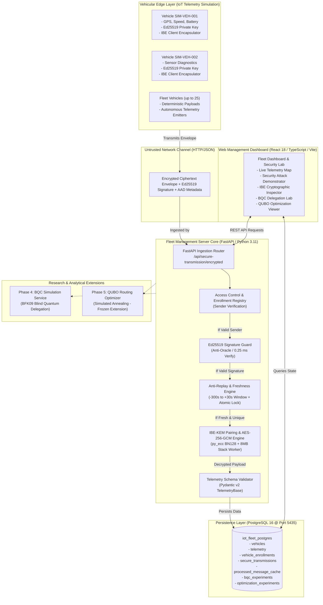

# 01 — Overall SMARTFLEET Architecture

```mermaid
graph TB
    subgraph EdgeLayer["Vehicular Edge Layer (IoT Telemetry Simulation)"]
        V1["Vehicle SIM-VEH-001<br/>- GPS, Speed, Battery<br/>- Ed25519 Private Key<br/>- IBE Client Encapsulator"]
        V2["Vehicle SIM-VEH-002<br/>- Sensor Diagnostics<br/>- Ed25519 Private Key<br/>- IBE Client Encapsulator"]
        VN["Fleet Vehicles (up to 25)<br/>- Deterministic Payloads<br/>- Autonomous Telemetry Emitters"]
    end

    subgraph Network["Untrusted Network Channel (HTTP/JSON)"]
        Wire["Encrypted Ciphertext Envelope + Ed25519 Signature + AAD Metadata"]
    end

    subgraph BackendCore["Fleet Management Server Core (FastAPI / Python 3.11)"]
        API["FastAPI Ingestion Router<br/>/api/secure-transmission/encrypted"]
        AC["Access Control & Enrollment Registry<br/>(Sender Verification)"]
        SIG["Ed25519 Signature Guard<br/>(Anti-Oracle / 0.25 ms Verify)"]
        RP["Anti-Replay & Freshness Engine<br/>(-300s to +30s Window + Atomic Lock)"]
        IBE["IBE-KEM Pairing & AES-256-GCM Engine<br/>(py_ecc BN128 + 8MB Stack Worker)"]
        VAL["Telemetry Schema Validator<br/>(Pydantic v2 TelemetryBase)"]
    end

    subgraph ResearchExtensions["Research & Analytical Extensions"]
        BQC["Phase 4: BQC Simulation Service<br/>(BFK09 Blind Quantum Delegation)"]
        QUBO["Phase 5: QUBO Routing Optimizer<br/>(Simulated Annealing - Frozen Extension)"]
    end

    subgraph StorageLayer["Persistence Layer (PostgreSQL 16 @ Port 5435)"]
        PG[("iot_fleet_postgres<br/>- vehicles<br/>- telemetry<br/>- vehicle_enrollments<br/>- secure_transmissions<br/>- processed_message_cache<br/>- bqc_experiments<br/>- optimization_experiments")]
    end

    subgraph PresentationLayer["Web Management Dashboard (React 18 / TypeScript / Vite)"]
        UI["Fleet Dashboard & Security Lab<br/>- Live Telemetry Map<br/>- Security Attack Demonstrator<br/>- IBE Cryptographic Inspector<br/>- BQC Delegation Lab<br/>- QUBO Optimization Viewer"]
    end

    EdgeLayer -->|Transmits Envelope| Wire
    Wire -->|Ingested by| API
    API --> AC
    AC -->|If Valid Sender| SIG
    SIG -->|If Valid Signature| RP
    RP -->|If Fresh & Unique| IBE
    IBE -->|Decrypted Payload| VAL
    VAL -->|Persists Data| PG

    BackendCore -.-> BQC
    BackendCore -.-> QUBO
    UI <-->|REST API Requests| API
    UI <-->|Queries State| PG
```
