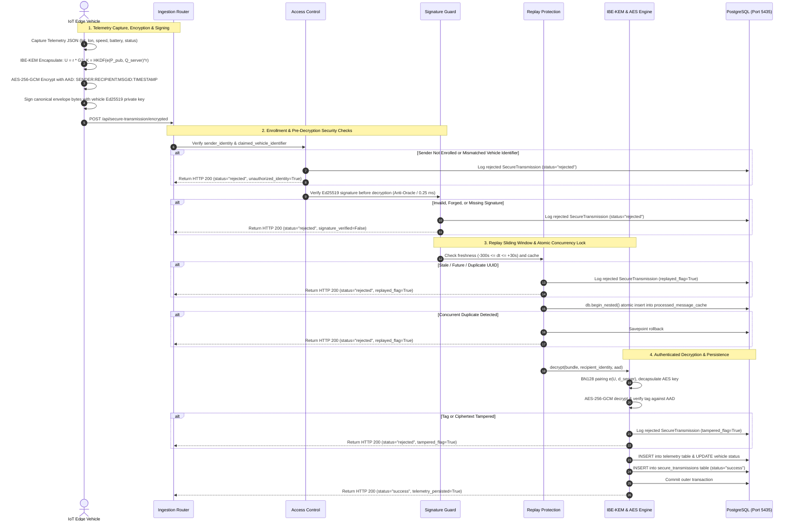

# 02 — Vehicle-to-Server Secure Transmission Sequence

```mermaid
sequenceDiagram
    autonumber
    actor V as IoT Edge Vehicle
    participant API as Ingestion Router
    participant AC as Access Control
    participant SIG as Signature Guard
    participant RP as Replay Protection
    participant IBE as IBE-KEM & AES Engine
    participant DB as PostgreSQL (Port 5435)

    Note over V,API: 1. Telemetry Capture, Encryption & Signing
    V->>V: Capture Telemetry JSON (lat, lon, speed, battery, status)
    V->>V: IBE-KEM Encapsulate: U = r * G2, K = HKDF(e(P_pub, Q_server)^r)
    V->>V: AES-256-GCM Encrypt with AAD: SENDER:RECIPIENT:MSGID:TIMESTAMP
    V->>V: Sign canonical envelope bytes with vehicle Ed25519 private key
    V->>API: POST /api/secure-transmission/encrypted

    Note over API,SIG: 2. Enrollment & Pre-Decryption Security Checks
    API->>AC: Verify sender_identity & claimed_vehicle_identifier
    alt Sender Not Enrolled or Mismatched Vehicle Identifier
        AC->>DB: Log rejected SecureTransmission (status="rejected")
        AC-->>API: Return HTTP 200 (status="rejected", unauthorized_identity=True)
    end

    AC->>SIG: Verify Ed25519 signature before decryption (Anti-Oracle / 0.25 ms)
    alt Invalid, Forged, or Missing Signature
        SIG->>DB: Log rejected SecureTransmission (status="rejected")
        SIG-->>API: Return HTTP 200 (status="rejected", signature_verified=False)
    end

    Note over SIG,IBE: 3. Replay Sliding Window & Atomic Concurrency Lock
    SIG->>RP: Check freshness (-300s <= dt <= +30s) and cache
    alt Stale / Future / Duplicate UUID
        RP->>DB: Log rejected SecureTransmission (replayed_flag=True)
        RP-->>API: Return HTTP 200 (status="rejected", replayed_flag=True)
    end
    RP->>DB: db.begin_nested() atomic insert into processed_message_cache
    alt Concurrent Duplicate Detected
        RP->>DB: Savepoint rollback
        RP-->>API: Return HTTP 200 (status="rejected", replayed_flag=True)
    end

    Note over IBE,DB: 4. Authenticated Decryption & Persistence
    RP->>IBE: decrypt(bundle, recipient_identity, aad)
    IBE->>IBE: BN128 pairing e(U, d_server), decapsulate AES key
    IBE->>IBE: AES-256-GCM decrypt & verify tag against AAD
    alt Tag or Ciphertext Tampered
        IBE->>DB: Log rejected SecureTransmission (tampered_flag=True)
        IBE-->>API: Return HTTP 200 (status="rejected", tampered_flag=True)
    end

    IBE->>DB: INSERT into telemetry table & UPDATE vehicle status
    IBE->>DB: INSERT into secure_transmissions table (status="success")
    IBE->>DB: Commit outer transaction
    IBE-->>API: Return HTTP 200 (status="success", telemetry_persisted=True)
```
