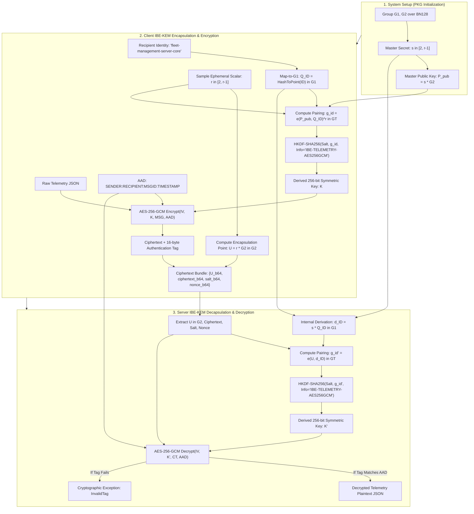

# 03 — IBE-KEM + AES-256-GCM Cryptographic Workflow

```mermaid
flowchart TD
    subgraph Setup["1. System Setup (PKG Initialization)"]
        G1["Group G1, G2 over BN128"] --> PKG["Master Secret: s in [2, r-1]"]
        PKG --> PUB["Master Public Key: P_pub = s * G2"]
    end

    subgraph Encapsulation["2. Client IBE-KEM Encapsulation & Encryption"]
        ID["Recipient Identity: 'fleet-management-server-core'"] --> MAP["Map-to-G1: Q_ID = HashToPoint(ID) in G1"]
        EPH["Sample Ephemeral Scalar: r in [2, r-1]"] --> U_CALC["Compute Encapsulation Point: U = r * G2 in G2"]
        MAP & EPH & PUB --> PAIR_ENC["Compute Pairing: g_id = e(P_pub, Q_ID)^r in GT"]
        PAIR_ENC --> KDF["HKDF-SHA256(Salt, g_id, Info='IBE-TELEMETRY-AES256GCM')"]
        KDF --> AES_KEY["Derived 256-bit Symmetric Key: K"]
        
        MSG["Raw Telemetry JSON"] & AAD["AAD: SENDER:RECIPIENT:MSGID:TIMESTAMP"] & AES_KEY --> GCM_ENC["AES-256-GCM Encrypt(IV, K, MSG, AAD)"]
        GCM_ENC --> CT["Ciphertext + 16-byte Authentication Tag"]
        U_CALC & CT --> BUNDLE["Ciphertext Bundle: {U_b64, ciphertext_b64, salt_b64, nonce_b64}"]
    end

    subgraph Decapsulation["3. Server IBE-KEM Decapsulation & Decryption"]
        BUNDLE --> EXT_RECV["Extract U in G2, Ciphertext, Salt, Nonce"]
        PKG & MAP --> PRIV_DERIV["Internal Derivation: d_ID = s * Q_ID in G1"]
        EXT_RECV & PRIV_DERIV --> PAIR_DEC["Compute Pairing: g_id' = e(U, d_ID) in GT"]
        PAIR_DEC --> KDF_DEC["HKDF-SHA256(Salt, g_id', Info='IBE-TELEMETRY-AES256GCM')"]
        KDF_DEC --> AES_KEY_DEC["Derived 256-bit Symmetric Key: K'"]
        
        EXT_RECV & AAD & AES_KEY_DEC --> GCM_DEC["AES-256-GCM Decrypt(IV, K', CT, AAD)"]
        GCM_DEC -->|If Tag Matches AAD| DEC_OK["Decrypted Telemetry Plaintext JSON"]
        GCM_DEC -->|If Tag Fails| DEC_FAIL["Cryptographic Exception: InvalidTag"]
    end

    Setup --> Encapsulation
    Encapsulation --> Decapsulation
```
