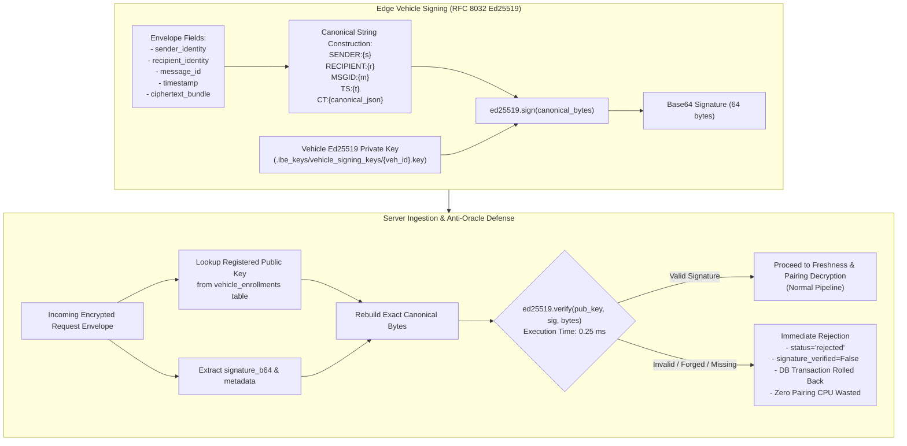

# 04 — Ed25519 Digital Signature & Anti-Oracle Workflow

```mermaid
flowchart TD
    subgraph ClientSigning["Edge Vehicle Signing (RFC 8032 Ed25519)"]
        PRIV["Vehicle Ed25519 Private Key<br/>(.ibe_keys/vehicle_signing_keys/{veh_id}.key)"]
        FIELDS["Envelope Fields:<br/>- sender_identity<br/>- recipient_identity<br/>- message_id<br/>- timestamp<br/>- ciphertext_bundle"]
        FIELDS --> CANON["Canonical String Construction:<br/>SENDER:{s}\nRECIPIENT:{r}\nMSGID:{m}\nTS:{t}\nCT:{canonical_json}"]
        CANON & PRIV --> SIGN["ed25519.sign(canonical_bytes)"]
        SIGN --> SIG_B64["Base64 Signature (64 bytes)"]
    end

    subgraph ServerVerification["Server Ingestion & Anti-Oracle Defense"]
        REQ["Incoming Encrypted Request Envelope"] --> EXT_PUB["Lookup Registered Public Key<br/>from vehicle_enrollments table"]
        REQ --> PARSE_SIG["Extract signature_b64 & metadata"]
        EXT_PUB & PARSE_SIG --> REBUILD["Rebuild Exact Canonical Bytes"]
        REBUILD --> VERIFY{"ed25519.verify(pub_key, sig, bytes)<br/>Execution Time: 0.25 ms"}
        
        VERIFY -->|Valid Signature| PROCEED["Proceed to Freshness & Pairing Decryption<br/>(Normal Pipeline)"]
        VERIFY -->|Invalid / Forged / Missing| REJECT["Immediate Rejection<br/>- status='rejected'<br/>- signature_verified=False<br/>- DB Transaction Rolled Back<br/>- Zero Pairing CPU Wasted"]
    end

    ClientSigning --> ServerVerification
```
