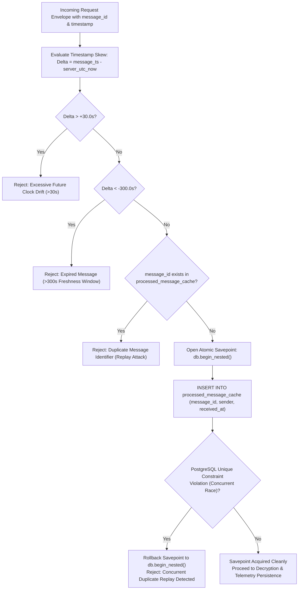

# 05 — Replay Protection & Concurrency Savepoint Workflow

```mermaid
flowchart TD
    START["Incoming Request Envelope with message_id & timestamp"] --> CLOCK["Evaluate Timestamp Skew: Delta = message_ts - server_utc_now"]
    
    CLOCK --> CHK_FUT{"Delta > +30.0s?"}
    CHK_FUT -->|Yes| REJ_FUT["Reject: Excessive Future Clock Drift (>30s)"]
    
    CHK_FUT -->|No| CHK_PAST{"Delta < -300.0s?"}
    CHK_PAST -->|Yes| REJ_PAST["Reject: Expired Message (>300s Freshness Window)"]
    
    CHK_PAST -->|No| CACHE_CHK{"message_id exists in<br/>processed_message_cache?"}
    CACHE_CHK -->|Yes| REJ_DUP["Reject: Duplicate Message Identifier (Replay Attack)"]
    
    CACHE_CHK -->|No| SAVEPOINT["Open Atomic Savepoint: db.begin_nested()"]
    SAVEPOINT --> INSERT["INSERT INTO processed_message_cache (message_id, sender, received_at)"]
    
    INSERT --> CONFLICT{"PostgreSQL Unique Constraint<br/>Violation (Concurrent Race)?"}
    CONFLICT -->|Yes| ROLLBACK["Rollback Savepoint to db.begin_nested()<br/>Reject: Concurrent Duplicate Replay Detected"]
    CONFLICT -->|No| SUCCESS["Savepoint Acquired Cleanly<br/>Proceed to Decryption & Telemetry Persistence"]
```
