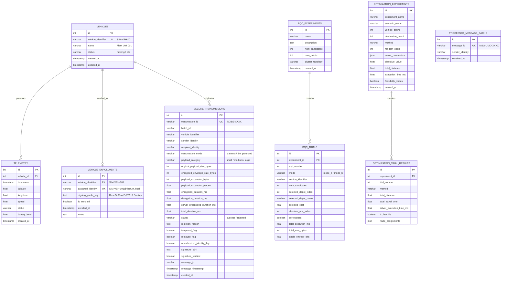

# 06 — PostgreSQL Database Entity-Relationship Diagram

```mermaid
erDiagram
    VEHICLES ||--o{ TELEMETRY : "generates"
    VEHICLES ||--o| VEHICLE_ENROLLMENTS : "enrolled_as"
    VEHICLES ||--o{ SECURE_TRANSMISSIONS : "originates"
    BQC_EXPERIMENTS ||--o{ BQC_TRIALS : "contains"
    OPTIMIZATION_EXPERIMENTS ||--o{ OPTIMIZATION_TRIAL_RESULTS : "contains"

    VEHICLES {
        int id PK
        varchar vehicle_identifier UK "SIM-VEH-001"
        varchar name "Fleet Unit 001"
        varchar status "moving / idle"
        timestamp created_at
        timestamp updated_at
    }

    VEHICLE_ENROLLMENTS {
        int id PK
        varchar vehicle_identifier FK "SIM-VEH-001"
        varchar assigned_identity UK "SIM-VEH-001@fleet.iot.local"
        text signing_public_key "Base64 Raw Ed25519 Pubkey"
        boolean is_enrolled
        timestamp enrolled_at
        text notes
    }

    TELEMETRY {
        int id PK
        int vehicle_id FK
        timestamp timestamp
        float latitude
        float longitude
        float speed
        varchar status
        float battery_level
        timestamp created_at
    }

    SECURE_TRANSMISSIONS {
        int id PK
        varchar transmission_id UK "TX-IBE-XXXX"
        varchar batch_id
        varchar vehicle_identifier
        varchar sender_identity
        varchar recipient_identity
        varchar transmission_mode "plaintext / ibe_protected"
        varchar payload_category "small / medium / large"
        int original_payload_size_bytes
        int encrypted_envelope_size_bytes
        int payload_expansion_bytes
        float payload_expansion_percent
        float encryption_duration_ms
        float decryption_duration_ms
        float server_processing_duration_ms
        float total_duration_ms
        varchar status "success / rejected"
        text rejection_reason
        boolean tampered_flag
        boolean replayed_flag
        boolean unauthorized_identity_flag
        text signature_b64
        boolean signature_verified
        varchar message_id
        timestamp message_timestamp
        timestamp created_at
    }

    PROCESSED_MESSAGE_CACHE {
        int id PK
        varchar message_id UK "MSG-UUID-XXXX"
        varchar sender_identity
        timestamp received_at
    }

    BQC_EXPERIMENTS {
        int id PK
        varchar name
        text description
        int num_candidates
        int num_qubits
        varchar cluster_topology
        timestamp created_at
    }

    BQC_TRIALS {
        int id PK
        int experiment_id FK
        int trial_number
        varchar mode "mode_a / mode_b"
        varchar vehicle_identifier
        int num_candidates
        int selected_depot_index
        varchar selected_depot_name
        float selected_cost
        int classical_min_index
        boolean correctness
        float total_execution_ms
        int total_wire_bytes
        float angle_entropy_bits
    }

    OPTIMIZATION_EXPERIMENTS {
        int id PK
        varchar experiment_name
        varchar scenario_name
        int vehicle_count
        int destination_count
        varchar method
        int random_seed
        json solver_parameters
        float objective_value
        float total_distance
        float execution_time_ms
        boolean feasibility_status
        timestamp created_at
    }

    OPTIMIZATION_TRIAL_RESULTS {
        int id PK
        int experiment_id FK
        int trial_number
        varchar method
        float total_distance
        float total_travel_time
        float solver_execution_time_ms
        boolean is_feasible
        json route_assignments
    }
```
