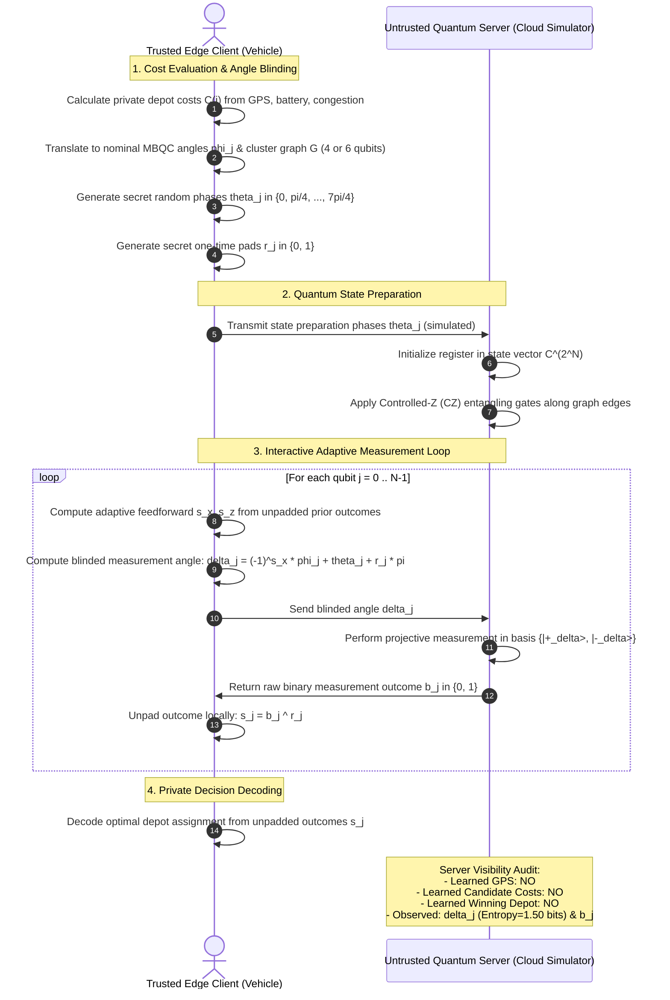

# 07 — Blind Quantum Computing (BQC) Client-Server Architecture

```mermaid
sequenceDiagram
    autonumber
    actor C as Trusted Edge Client (Vehicle)
    participant S as Untrusted Quantum Server (Cloud Simulator)

    Note over C: 1. Cost Evaluation & Angle Blinding
    C->>C: Calculate private depot costs C(i) from GPS, battery, congestion
    C->>C: Translate to nominal MBQC angles phi_j & cluster graph G (4 or 6 qubits)
    C->>C: Generate secret random phases theta_j in {0, pi/4, ..., 7pi/4}
    C->>C: Generate secret one-time pads r_j in {0, 1}

    Note over C,S: 2. Quantum State Preparation
    C->>S: Transmit state preparation phases theta_j (simulated)
    S->>S: Initialize register in state vector C^(2^N)
    S->>S: Apply Controlled-Z (CZ) entangling gates along graph edges

    Note over C,S: 3. Interactive Adaptive Measurement Loop
    loop For each qubit j = 0 .. N-1
        C->>C: Compute adaptive feedforward s_x, s_z from unpadded prior outcomes
        C->>C: Compute blinded measurement angle: delta_j = (-1)^s_x * phi_j + theta_j + r_j * pi
        C->>S: Send blinded angle delta_j
        S->>S: Perform projective measurement in basis {|+_delta>, |-_delta>}
        S->>C: Return raw binary measurement outcome b_j in {0, 1}
        C->>C: Unpad outcome locally: s_j = b_j ^ r_j
    end

    Note over C: 4. Private Decision Decoding
    C->>C: Decode optimal depot assignment from unpadded outcomes s_j
    Note over S: Server Visibility Audit:<br/>- Learned GPS: NO<br/>- Learned Candidate Costs: NO<br/>- Learned Winning Depot: NO<br/>- Observed: delta_j (Entropy=1.50 bits) & b_j
```
