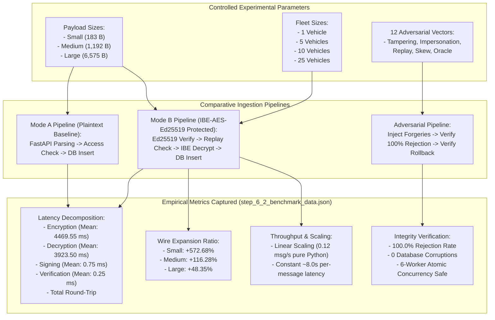

# 08 — Experimental Evaluation & Benchmark Workflow

```mermaid
flowchart TD
    subgraph InputParameters["Controlled Experimental Parameters"]
        PAYLOADS["Payload Sizes:<br/>- Small (183 B)<br/>- Medium (1,192 B)<br/>- Large (6,575 B)"]
        FLEET["Fleet Sizes:<br/>- 1 Vehicle<br/>- 5 Vehicles<br/>- 10 Vehicles<br/>- 25 Vehicles"]
        ATTACKS["12 Adversarial Vectors:<br/>- Tampering, Impersonation,<br/>  Replay, Skew, Oracle"]
    end

    subgraph ExecutionPipelines["Comparative Ingestion Pipelines"]
        MODE_A["Mode A Pipeline (Plaintext Baseline):<br/>FastAPI Parsing -> Access Check -> DB Insert"]
        MODE_B["Mode B Pipeline (IBE-AES-Ed25519 Protected):<br/>Ed25519 Verify -> Replay Check -> IBE Decrypt -> DB Insert"]
        ATTACK_RUN["Adversarial Pipeline:<br/>Inject Forgeries -> Verify 100% Rejection -> Verify Rollback"]
    end

    subgraph MetricsCapture["Empirical Metrics Captured (step_6_2_benchmark_data.json)"]
        LAT["Latency Decomposition:<br/>- Encryption (Mean: 4469.55 ms)<br/>- Decryption (Mean: 3923.50 ms)<br/>- Signing (Mean: 0.75 ms)<br/>- Verification (Mean: 0.25 ms)<br/>- Total Round-Trip"]
        EXP["Wire Expansion Ratio:<br/>- Small: +572.68%<br/>- Medium: +116.28%<br/>- Large: +48.35%"]
        TPUT["Throughput & Scaling:<br/>- Linear Scaling (0.12 msg/s pure Python)<br/>- Constant ~8.0s per-message latency"]
        RES["Integrity Verification:<br/>- 100.0% Rejection Rate<br/>- 0 Database Corruptions<br/>- 6-Worker Atomic Concurrency Safe"]
    end

    PAYLOADS --> MODE_A & MODE_B
    FLEET --> MODE_B
    ATTACKS --> ATTACK_RUN

    MODE_A --> LAT
    MODE_B --> LAT & EXP & TPUT
    ATTACK_RUN --> RES
```
